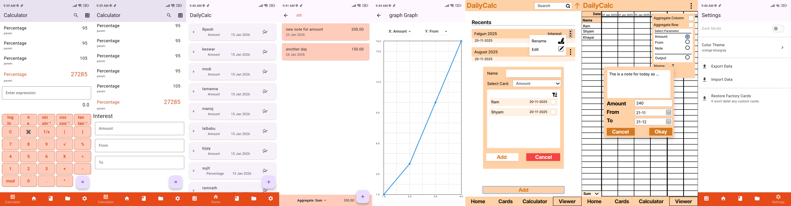

# DailyCalc

## Introduction

**DailyCalc** is a lightweight yet powerful accounting and calculation application built using **Flutter** and modern mobile architecture principles. The app is designed for **small business owners, shopkeepers, daily money collectors (door-to-door), accountants, and individuals** who want a reliable way to track calculations, transactions, savings, expenses, and daily financial activities. It is also useful for **students** and those who loves **cutomizable formulas** to suite their own needs. 

Unlike heavy accounting software, DailyCalc focuses on **speed, clarity, and flexibility**, allowing users to create reusable calculation cards (like Interest, Percentage, Amount, etc.) and use them instantly in real-world scenarios.

---

## Previews



## Target Users

DailyCalc is ideal for:

* Small shop owners
* Local businesses
* Door-to-door money collectors
* Accountants handling quick calculations
* Individuals tracking savings and expenses
* Anyone who needs **repeatable financial calculations without complexity**
* studends can use for **data collection for projects, create formulas that suite their needs and visualize graphs**

---

## Key Features

* 📊 **Reusable Calculation Cards** (Interest, Percentage, Custom formulas)
* 🧮 **Dynamic Input Fields** with real-time calculation
* ⭐ **Favorite Cards** for quick access
* 💾 **Offline-First** (local storage, no internet required)
* 🔁 **State Persistence** (data survives app restarts)
* 🧱 **Clean Architecture** for maintainability and scalability
* 🔐 **Business-grade code structure** using BLoC

---

## Architecture Overview

DailyCalc follows **Flutter Clean Architecture**, separating responsibilities clearly to ensure:

* Easy maintenance
* Testability
* Scalability
* Predictable behavior

### Layers Used

#### 1. Presentation Layer

* Flutter UI widgets
* Handles rendering, user interaction, and navigation
* Uses **BLoC** for state management

#### 2. Domain Layer

* Business logic
* Entities (Card, Field, Formula)
* Use cases (Save Card, Update Field, Calculate Result)

#### 3. Data Layer

* Models and mappers
* Local data sources (Hive / local storage)
* Repository implementations

---

## State Management – BLoC

The app uses **BLoC (Business Logic Component)** for predictable and testable state management.

### Why BLoC?

* Clear separation of UI and logic
* Event-driven architecture
* Scales well for business applications
* Prevents tightly coupled UI logic

### Example Flow

1. User types a value
2. UI dispatches an event (e.g., `CardFieldUpdated`)
3. BLoC processes the event
4. New state is emitted
5. UI rebuilds reactively

---

## Hive package

This app uses hive to accomodate the fast data storing and efficient access. Datasource directly accesses the hive boxes to maintain the storage.

-----

## Screen-by-Screen Overview

### 1. Home Screen

**Purpose:**

* Entry point of the app
* Displays all available calculation cards
* calculation cards are the actual storage where you can create a list of inputs 

**Features:**

* List of cards (Someone's Interest, Percentage, etc.)
* Favorite card highlighting
* Quick access to frequently used calculations

**Advantages:**

* Minimal clutter
* Fast access to daily calculations

---

### 2. Card Input Screen

**Purpose:**

* Allows users to input values for a selected card

**Features:**

* Dynamic fields based on card definition
* Supports numeric and text input
* Real-time calculation output

**Advantages:**

* No fixed forms
* Same screen adapts to different card types

---

### 3. Result Display

**Purpose:**

* Shows computed result based on formulas

**Features:**

* Instant updates on input change
* Formula-driven calculation engine

**Advantages:**

* Eliminates manual math errors
* Faster decision making

---

### 4. Favorites

**Purpose:**

* Quick access to frequently used cards

**Features:**

* Mark/unmark cards as favorite
* Favorites appear at top

**Advantages:**

* Saves time for repetitive tasks

---

### 5. Settings / Info Screen

**Purpose:**

* App information and configuration

**Features:**

* App description
* Version info
* Future scope for backup/export

---

## Data Persistence

* Default cards are **seeded once per device**
* User data is stored locally
* App works fully **offline**

This makes DailyCalc reliable even in areas with poor internet connectivity.

## Future Enhancements (Planned)

* Transaction history
* Export to PDF / Excel
* Cloud backup
* Multi-device sync
* User-defined custom cards

---

## Conclusion

DailyCalc is built with the philosophy that **accounting tools should be simple, fast, and reliable**. By combining Flutter, Clean Architecture, and BLoC, the app delivers a business-grade experience while remaining easy to use for individuals and small businesses.

Whether you are tracking daily collections, calculating interest, managing expenses, or simply monitoring your savings, **DailyCalc keeps your numbers clear and under control**.


----------------------------------------------------------------


# left

- for thik karing in dad's thingi just add __%*%__1704067300000__%*%__1704087300000 to dad's sheet name

- make all the conversion formulas that a calculator gives, and some more formulas
- make more useful formulas

- manual

- last feature is to check for update through github, and ask the user for update.

# Json structure
1) Home
```
[
    {
        name,
        created_on,      -- it is also used as id
        type,      -- illustrates which card it is derived from
        typeId,
        items:[
            {
                note,
                date,
                created-on,       -- it is also used as its id
                inputs:{},
                output
            }
        ],
        aggregate_function: "average",
        graph:{x:"amount" , y:"output"}
    }
]
```

2) Cards
```
[
    {
        name,
        create_on,         -- also used for id
        is_favourite,
        inputs:[{name:type}],
        formulas:[
            {name:value}       -- each is computed one after other like intepretor
        ]
        output
    }
]
```


3) Calculator history
```
[
    {
        type,      -- if null means normal calculator
        date,
        typeId,    -- type's created date and time is its id
        inputs:[{name:value}], -- if notmal calc then no array
        output
    }
]
```

4) Final
{
    theme:{
        font, fontsize, colors:[]
    },
    home:[...],
    cards:[...],
    calc_history:[...]

}


### For Hive

1a. Field
```
@HiveType(typeId: 1)
class Field {
  @HiveField(0) String sym;
  @HiveField(1) String type;
}

@HiveType(typeId: 2)
class Formula {
  @HiveField(0) int pos;
  @HiveField(1) String sym;
  @HiveField(2) String formula;
}

```

1b. cards
```
@HiveType(typeId: 3)
class CardModel {
  @HiveField(0) String name;
  @HiveField(1) int createdOn; // will be used as id
  @HiveField(2) bool isFavourite; 
  @HiveField(3) List<Field> fields; 
  @HiveField(4) List<Formula> formulas; 
  @HiveField(5) String output;
}
```

2a. HomeItem, Graph, Input
```
@HiveType(typeId: 4)
class Input {
  @HiveField(0) String name;
  @HiveField(1) String value;
}

@HiveType(typeId: 5)
class HomeItem {
  @HiveField(0) String note;
  @HiveField(1) int createdOn; // will be use as id
  @HiveField(2) int date;
  @HiveField(3) List<Input> inputs;
  @HiveField(4) int output; 
}

```

2b. Home
```
@HiveType(typeId: 6)
class HomeModel {
  @HiveField(0) String name;
  @HiveField(1) int createdOn; // will be use as id
  @HiveField(2) CardModel type;
  @HiveField(3) int CardId; // card createOn is used as card id
  @HiveField(4) List<HomeItem> items; // 
  @HiveField(5) String aggregateFunction;
  @HiveField(6) int output;
}

```

3) calculator history
```
@HiveType(typeId: 7)
class CalcHistory {
  @HiveField(0) CardModel? type;
  @HiveField(1) int date;
  @HiveField(2) int? CardId; // card createOn is used as card id
  @HiveField(3) List<Input> inputs;
  @HiveField(4) int output;
}

```

4) settings
```
@HiveType(typeId: 8)
class ThemeSettings {
  @HiveField(0) String font;
  @HiveField(1) double fontSize;
  @HiveField(2) String theme;
}
```

4) spreadsheet
```
@HiveType(typeId: 9)
class SpreadSheet {
  @HiveField(0) String name;
  @HiveField(1) String cardName;
  @HiveField(2) String cardId; // uses the createdOn as id
  @HiveField(3) String createdOn; 
  @HiveField(4) List<string> homeCardIds;
}
```


# colors keep in mind
```
# Primary Color
  Main brand color
  AppBar background
  FloatingActionButton
  Primary buttons
  Active tabs / selected items
  Progress indicators

# Light Primary Color
  Selected list item background
  Card highlights
  Chips
  Hover / pressed states
  Progress background

Dark Primary Color
Status bar overlay
Strong emphasis areas
Active indicators
Headers on light backgrounds

Accent Color
Secondary buttons
Switches & toggles
Checkboxes & radio buttons
Selection cursor
Links & highlights

Primary Text Color
Page titles
Section headers
Card titles
Main readable content

Secondary Text Color
Subtitles
Descriptions
Hints & helper text
Timestamps
Disabled text

Text / Icons Color
Icons on AppBar
Icons on buttons
Text displayed on primary or accent colors
Foreground color on colored surfaces

Divider Color
Divider widgets
List separators
Table borders
Input field underlines
```


# Final thoughts on material color
- use 
  - primary , primary light, primary dark
    - used for almost everything including appbar
    - lighter colors can be used to suggest hovering
    - darker to create contrast
  - secondary, secondary light, secondary dark
    - used sparingly here and there, it is optional to use secondaryy colors.
    - eg, floating action buttin, text highlight, links, selected items ,etc
  - background, surface, error
    - background ,card colors and error cards respectively
  - onPrimary, onSecondary, onBackground, onSurface, onError
    - like text or icons on primary, secondary, background, surface or error
- some situations that can happen
  - using "primary" on selected cards "surface"
  - dark theme can use a inverted color style

